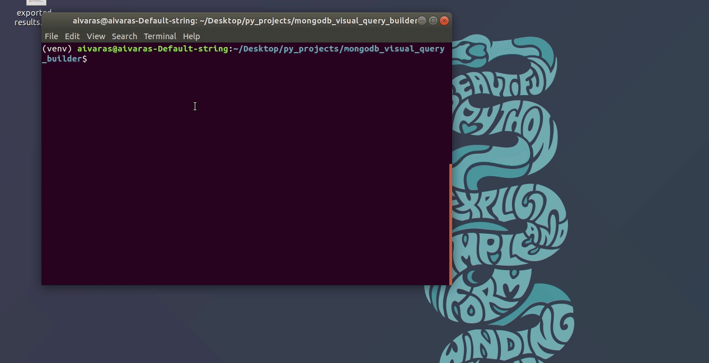

# Visual Query Builder
Python/Tkinter MongoDB visual query builder

## Usage

```bash
# Install dependencies
pip install -r requirements.txt

# Run script
python visual_query_builder.py

# Tutorial
Outside app: help.txt file
Inside app: 'Help' -> 'About' in main menu
```

# Demo

